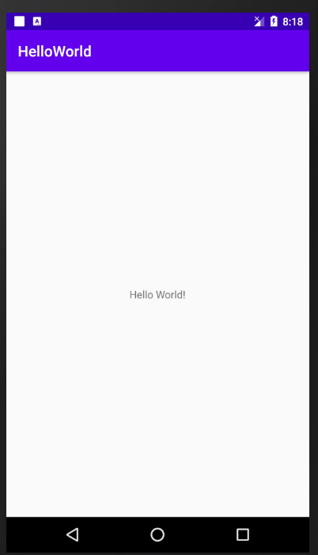

## 实验要求：工具链安装和HELLOWORLD程序
## 实验目的：创建第一个Android项目
## 实验内容：

​	下面是我创建的第一个Android项目，名为HelloWorld，以下是它运行时的界面。

## 实验总结：
### 评价：第一次创建Android项目，对其中的代码和运行原理还有很多不懂的地方，通过书本和老师的指导逐渐了解。

我的链接：https://github.com/lonely1929/2018118141_Android