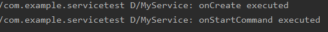

## 实验要求：10.服务：启动和停止服务，服务代码运行在显示子线程。	11.子服务的绑定，子服务代码运行在异步任务。

## 实验目的：了解服务以及服务在子线程中如何运行

## 实验内容：

​	点击Start Service按钮，观察logcat的打印日志，onCreate()和onStartCommand()方法都执行了，说明服务启动成功，再点击一下Stop Service按钮，执行onDestro()方法，停止服务。onCreate()方法在服务第一次创建时调用，而onStartCommand()方法在每次启动服务都会调用，多点击几次Start Service按钮，会发现只有onStartCommand()方法得到执行。

​	点击Bind Service按钮进行绑定服务，然后观察logcat打印的日志

点击Start Service或Bind Service按钮，MyService就会以前台服务的模式启动，并且在系统状态栏会显示一个通知图标。

​	打印MainActivity和MyIntentService所在线程的id，两者的id不一样，但onDestroy()方法都得到了执行，说明MyIntentService在运行完毕后确实自动停止了。

### 服务的最佳实践，完整版的下载示例：

申请访问SD卡的权限

​	下载软件中

​	下载成功

## 实验总结：

### 评价：了解到很多关于服务的知识点，集开启线程和自动停止于一身，是个很好的方法。

