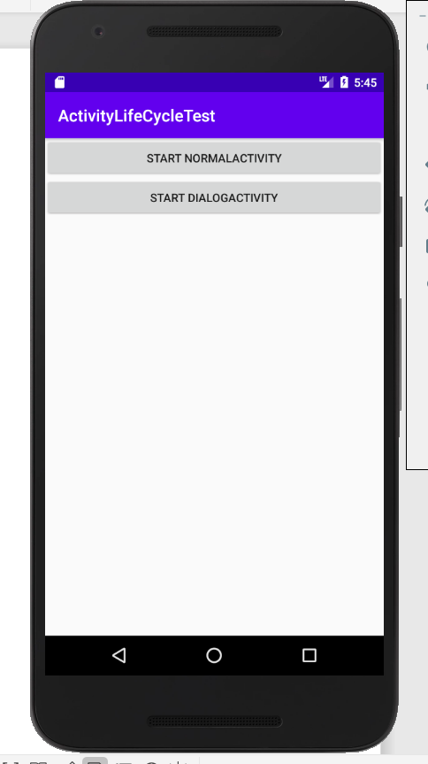
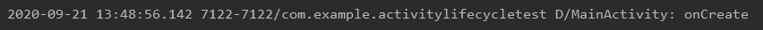
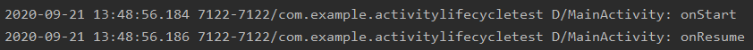

## 实验要求：通过实践掌握四种启动模式
## 实验目的：了解并体会四种启动模式的不同
## 实验内容：
#### standard模式(标准模式)

在FirstActivity界面每点击一次按钮就会创建一个新的实例，假如点击了两次按钮，则此时返回栈中存在3个FirstActivity的实例，退出程序时则需要连按3词Back键。

#### singleTop模式(单顶模式)

当运行程序时，已经创建了一个FirstActivity的实例，此后无论点击多少次都不会新的实例被创建，因为FirstActivity已经在返回栈的栈顶，仅需按一次Back键即可退出。

不过当FirstActivity不在栈顶时，再启动FirstActivity依旧会创建新的实例。在SecondActivity中启动FirstActivity时，SecondActivity处于栈顶，所以会创建一个新的FirstActivity的实例，这时要连按三次Back键，返回SecondActivity再返回FirstActivity，最后才退出程序。

#### singleTask模式(单任务模式)

在SecondActivity中启动FirstActivity时，返回栈中已经存在一个FirstActivity的实例，在SecondActivity下面，此时SecondActivity会从返回栈中出栈，FirstActivity重新回到栈顶，且返回栈中只剩下一个FirstActivity的实例，按一次Back键即可退出程序。

#### singleInstance模式(单实例模式)

运行程序，在FirstActivity界面点击按钮进入SecondActivity，在SecondActivity界面点击按钮进入ThirdActivity。SecondActivity被放在一个单独的返回栈里，且栈中只有SecondActivity，而FirstActivity和ThirdActivity则存放在同一个栈中，所以在ThirdActivity界面按下Back键时，ThirdActivity从返回栈出栈，FirstActivity成为栈顶活动，然后在FirstActivity界面按下Back键，此时该返回栈为空，就显示另一个返回栈的栈顶活动，即SecondActivity，这是再次按下Back键，则所有返回栈都为空，退出程序。

## 实验总结：
### 评价：从中了解到四种启动模式的不同和返回栈的栈顶活动
### 心得收获：在实际应用中应根据特定的需求为每个活动指定恰当的启动模式