### 实验目的： 掌握常用控件的使用方法：TextView、Button、EditText、ImageView、AlertDialog、ProgressDialog

### 实验内容：

​	TextView最简单的控件，在界面上显示一段文本，可以使用一些属性调节位置和字体颜色等 

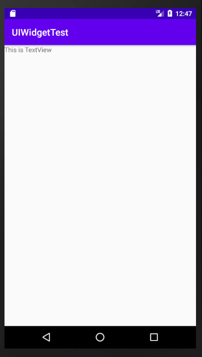

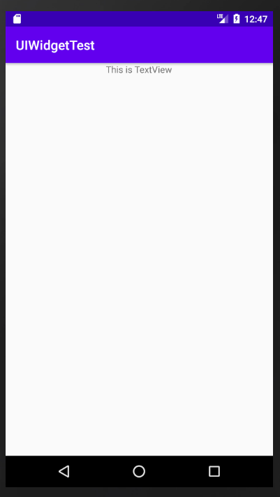

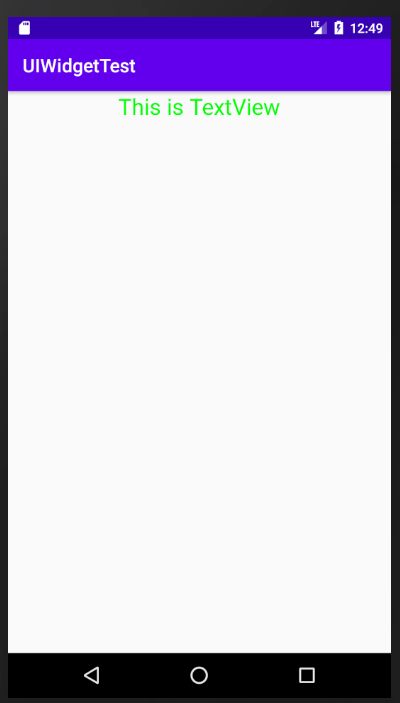

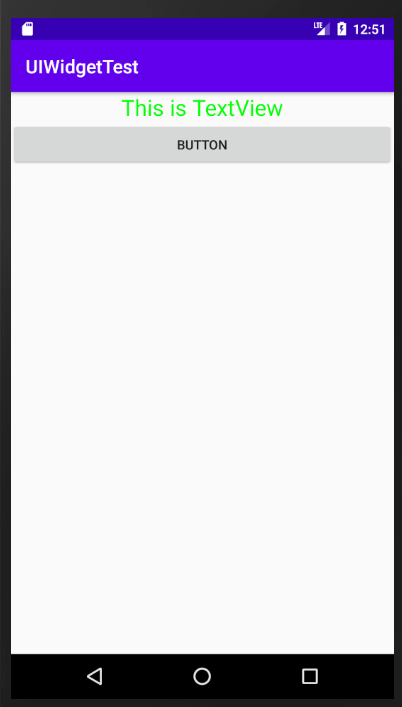

​	EditText是程序用于和用户交互的另一个主要控件，它允许用户在控件里输入和编辑内容，并可以在程序中对这些内容进行处理 

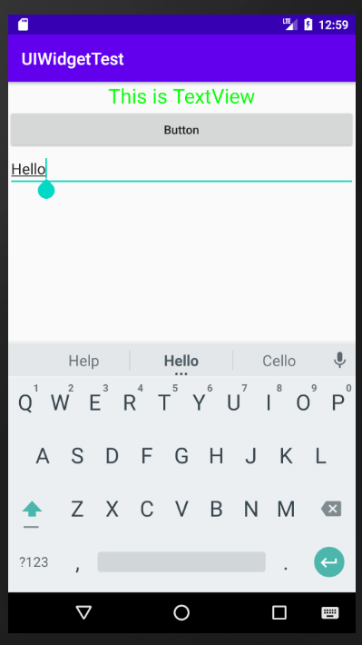

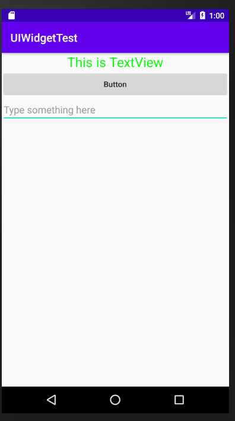

​	指定EditText的最大行数为两行

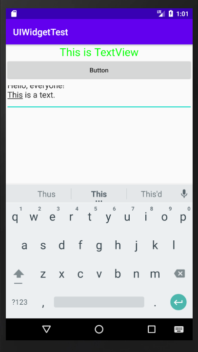

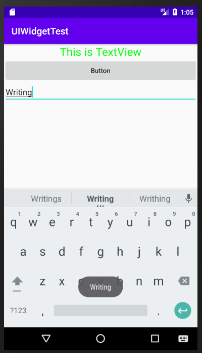

​	ImageView是用于在界面上展示图片的一个控件，使我们的界面变得更加丰富多彩 

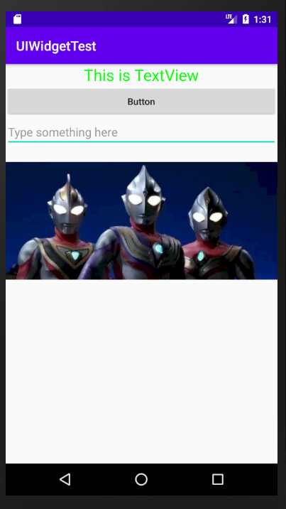

​	还可以在程序中动态地更改ImageView中的图片 

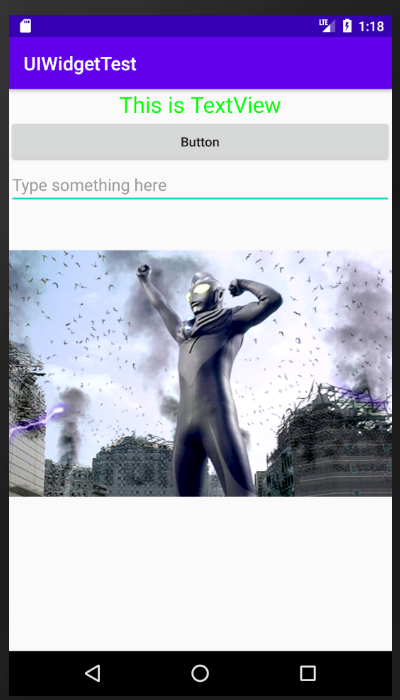

​	设置一个圆形进度条表示程序正在加载一些数据。

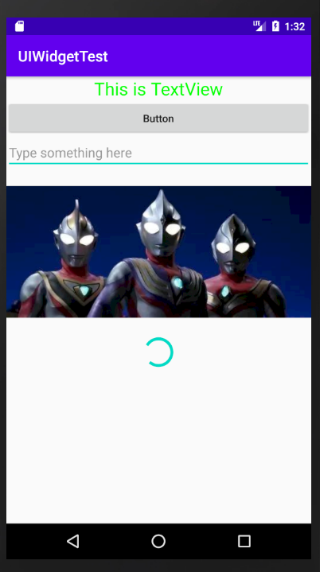

​	也可以设置水平进度条，每点击一次Button就会现有进度上加10

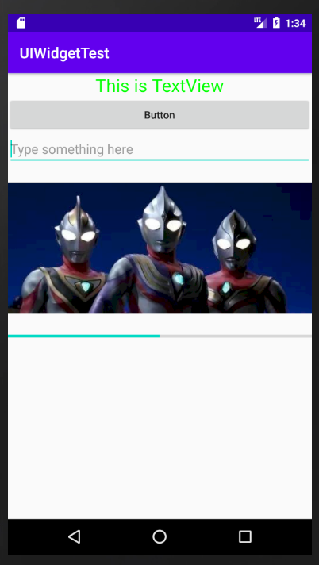

​	AlertDialog可以在当前界面弹出一个对话框，这个对话框时置顶于所有界面元素之上的，能够屏蔽其他控件的交互能力，下列时当退出程序时，提示是否退出的对话框 

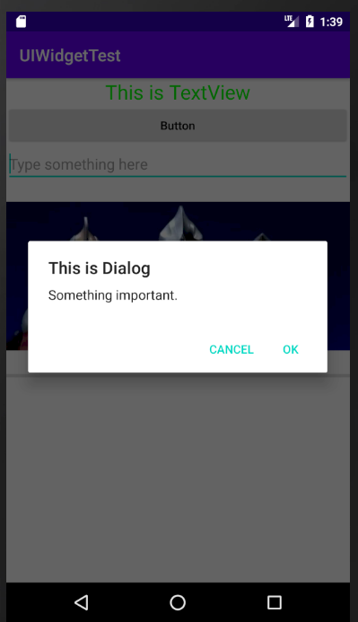

​	ProgressDialog会在会话框中显示一个进度条，一般用于表示当前操作比较耗时，让用户耐心地等待。

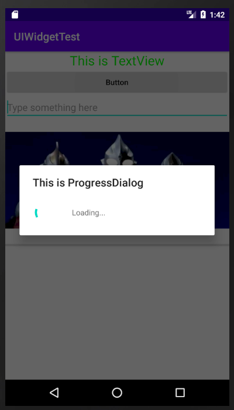