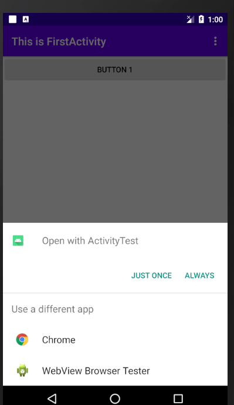

## 实验要求：熟悉Intent应用
## 实验目的：通过实验了解Intent应用，特别是系统内置隐含Intent和自定义的Intent的使用
## 实验内容：

​	1.显式Intent：在FirstActivity的界面点击一下按钮就会启动SecondActivity活动。

​	2.隐式Intent：在FirstActivity的界面点击一下按钮就可以打开浏览器。

​	3.隐式Intent：ThirdActivity应该和浏览器一样，能够响应一个打开网页的Intent，在FirstActivity的界面点击一下按钮，结果如下图所示。

​	4.隐式Intent：在FirstActivity的界面点击一下按钮就可以打开系统拨号界面。

​	5.向下一个活动传递数据：在SecondActivity中成功得到了从FirstActivity传递过来的数据。

6.返回数据给上一个活动：SecondActivity已经成功返回数据给FirstActivity了。

## 实验总结：

### 评价：能够熟悉地了解到显示和隐式Intent和使用Intent在活动之间穿梭。
