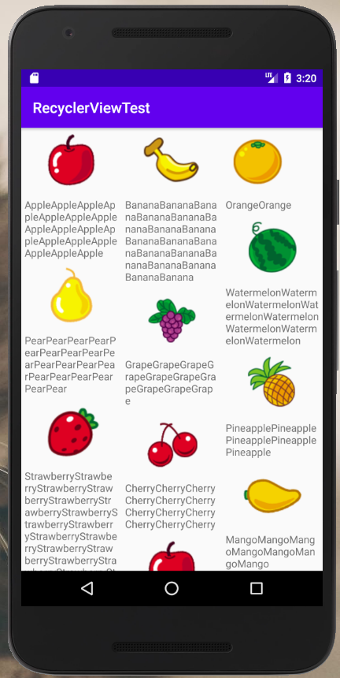
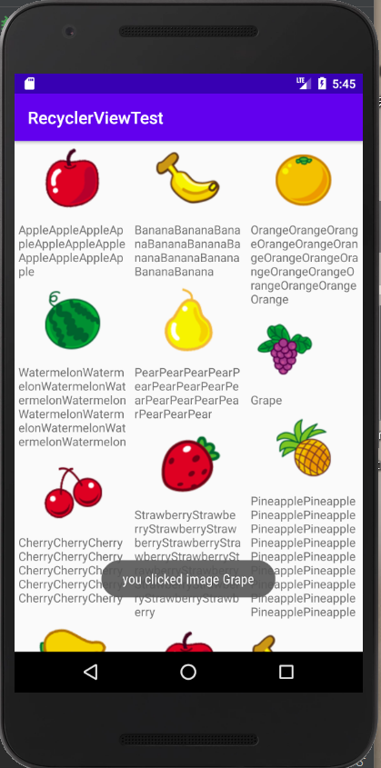

## 实验要求：创建一个滚动控件RecyclerView的项目
## 实验目的：学习并掌握RecyclerView的使用
## 实验内容：

​	纵向滚动：RecyclerView实现了和ListView几乎一模一样的效果，代码量虽然没有明显减少，但逻辑更加清晰。

​	横向滚动：ListView扩展性不好，只能实现纵向滚动的效果，但RecyclerView能实现横向滚动。

​	瀑布流布局：

​	RecyclerView的点击事件：RecyclerView也能响应点击事件，但是RecyclerView并没有提供注册监听器方法，那就需要给子项具体的ListView注册点击事件。

## 实验总结：

### 评价：在实践中逐渐了解到RecyclerView控件的使用，在xml文件中的修改还是特别注意一下的。
### 心得收获：感觉RecyclerView控件的可操作性还是很大的，通过它所创建的布局会比ListView有趣。