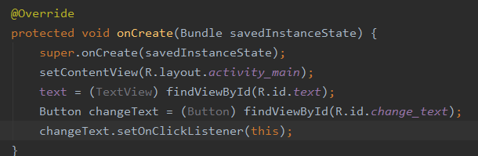
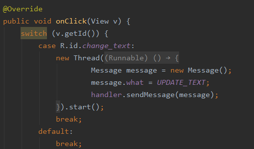

## 实验要求：8.创建子线程的程序框架，消息处理机制和多线程之间的数据交换	9.异步任务的隐含子线程程序框架

## 实验目的：创建子线程，了解消息处理机制和异步任务，还有多线程之间的数据交换

## 实验内容：

​	ChangeText按钮的点击事件会开启一个子线程，但是在子线程中更新UI，观察logcat中的错误日志可知是错误是由此导致的。

​	重新运行程序，可以看到屏幕的显示着HelloWorld。然后点击ChangeText按钮，显示的内容就被替换成Nice to see you。Message是在线程之间传递的消息，用于在不同线程之间交换数据。Handler主要是用于发送和处理消息的，发送消息一般是使用Handler的sendMessage()方法。

## 实验总结：

### 评价：使用Android异步消息处理机制可以轻松地解决掉在子线程中更新UI的问题，从实验中了解到这种机制的工作原理。