### 1.主页面布局：

​	布局文件activity_main.xml：

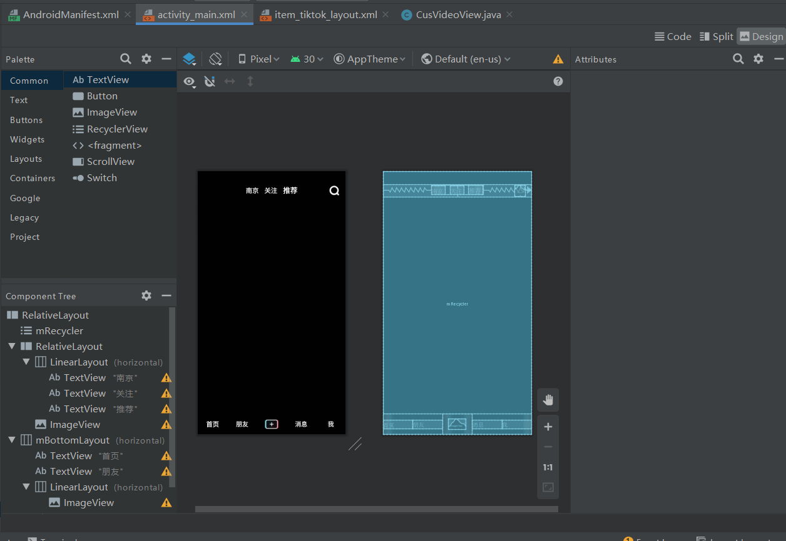

​	

​	由于VideoView想要自己设置宽和高，所以这里自定义一个VideoView，重写onMeasure()测量方法：

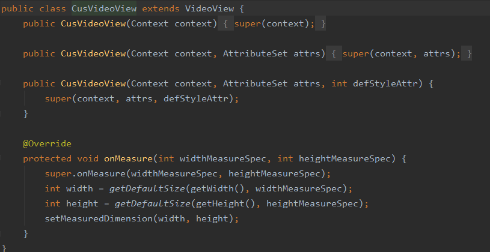

​	然后接着来编写每一屏Item的布局文件：item_tiktok_layout.xml

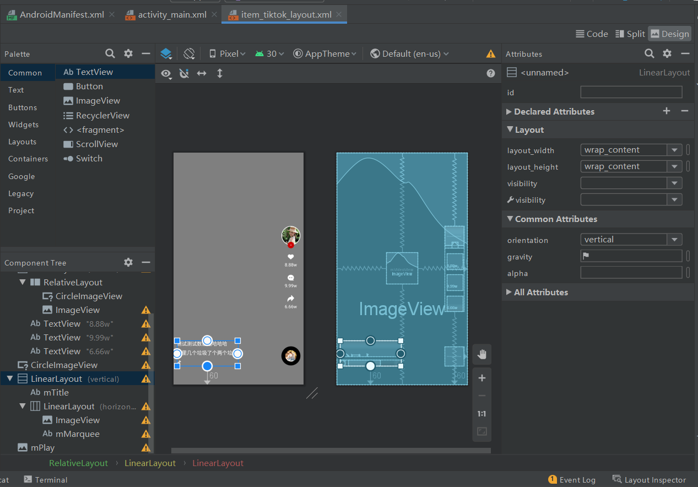

​	然后创建列表Item的适配器TiktokAdapter.java：

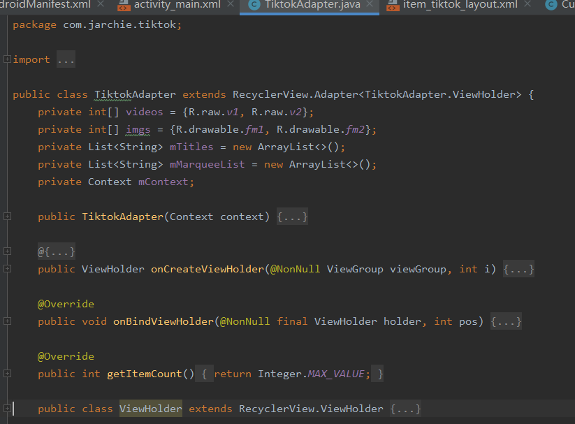

### 2.自定义LayoutManager

​	RecyclerView里面有这样一个接口：它里面有两个方法，可以监听列表的Item添加进来和移除出去的两个动作，每一屏只有一个Item，并且要在它被添加进来的时候播放视频，在移除时释放掉，所以我们需要实现这个接口。需要注意的是，这个接口必须在LayoutManager成功进行初始化之后才能监听，所以在LayoutManager中重写onAttachedToWindow()方法，在它里面添加这个接口的监听：

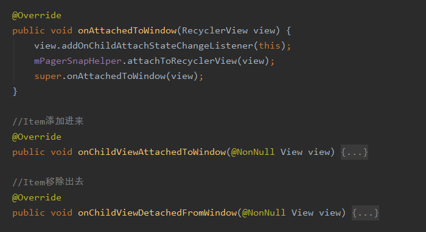

​	还得重写另一个监听位移变化的方法：scrollVerticallyBy()，这里dy的值为正数是往上滑，负数是往下滑

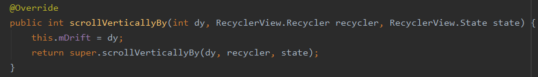

​	在这两个方法中，我们需要把具体的业务逻辑回调到Activity里面去处理，所以这里我们还需要再自定义一个接口OnPageSlideListener 

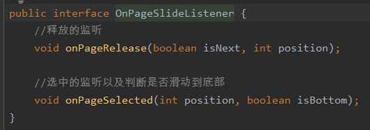

​	处理上面的两个回调接口onChildViewAttachedToWindow()和onChildViewDetachedFromWindow()：

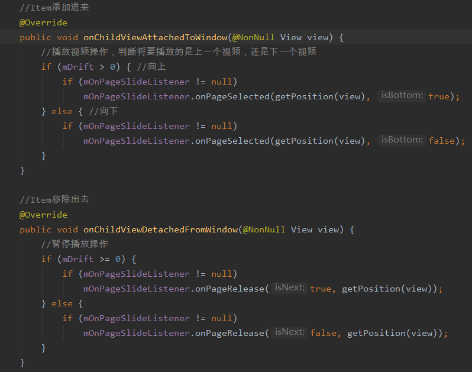

​	通过接口的方式回调到Activity中实现，给它设置一个接口：

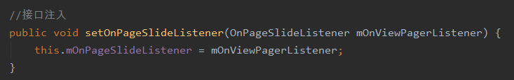

​	PagerSnapHelper，它可以实现让RecyclerView像ViewPager一样的滑动效果

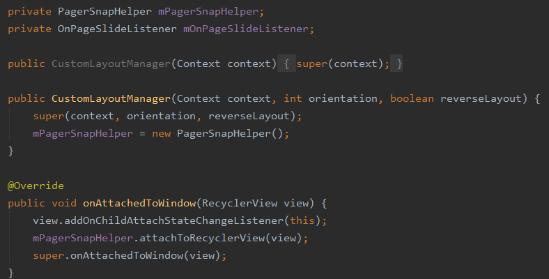

​	还需要重写一个方法，不然的话向下滑动播放的时候会有Bug：因为onChildViewAttachedToWindow()和onChildViewDetachedFromWindow()这两个方法并不是成对出现的，它们二者之间也是没有顺序的，因此这里再来监听一下滑动状态的改变：判断已经处理完成即手指抬起时的状态

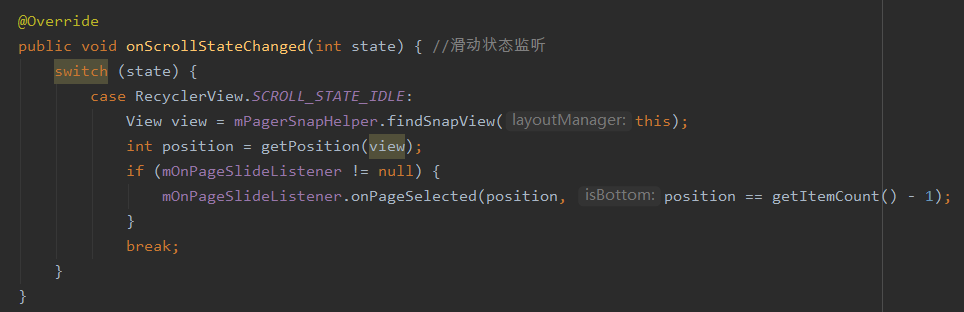

### 3.实现播放

​	在Activity中实现播放和停止的方法：

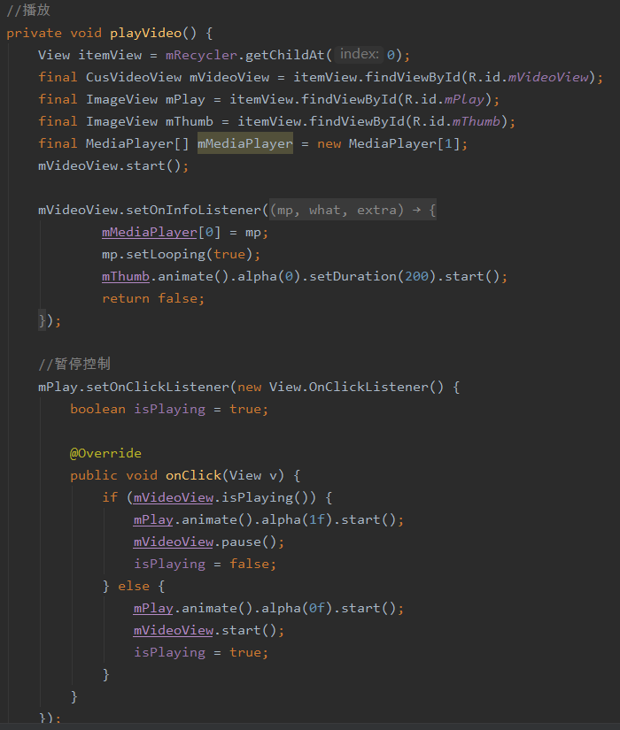

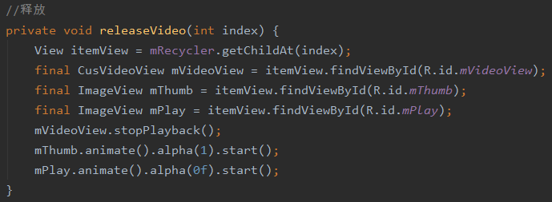

​	然后处理LayoutManager中回调到Activity中的播放逻辑：

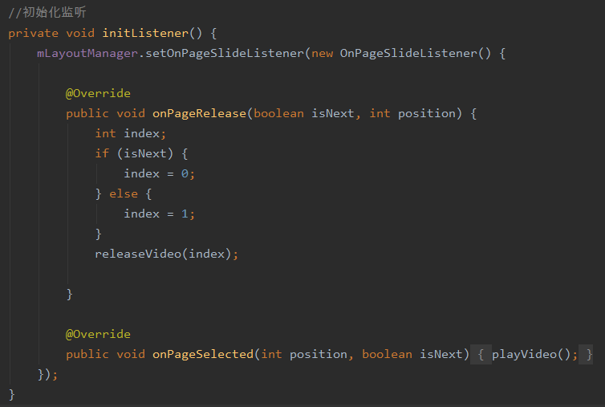

​	运行过程：

