MainActivity第一次被创建时会一次执行onCreate()、onStart()和onResume()方法。

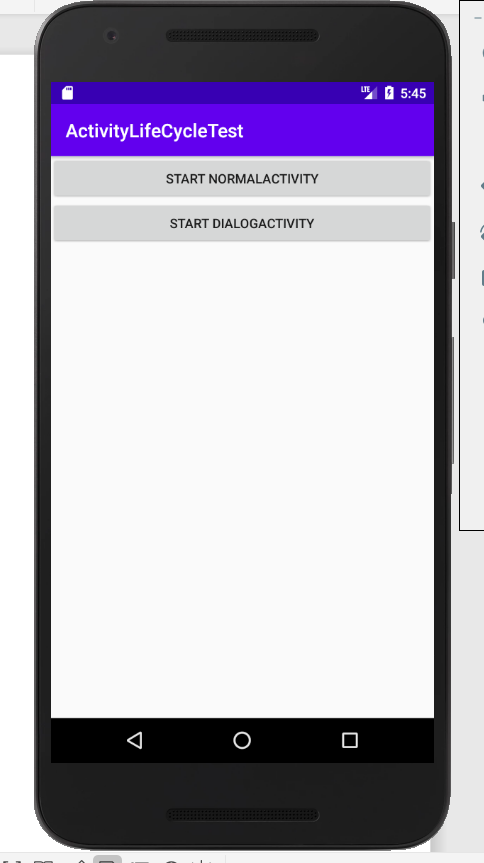

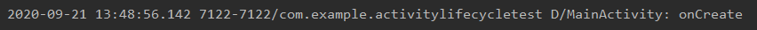

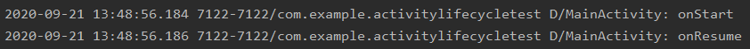

点击第一个按钮，启动NomalActivity，NomalActivity会将MainActivity完全遮挡，并执行onPause()和onStop()方法，此时MainActivity进入了停止状态。

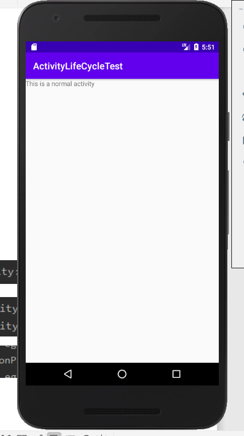

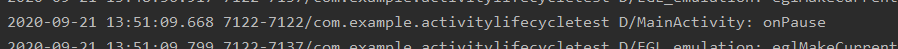

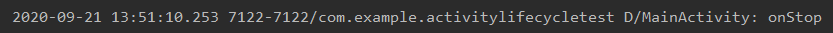

按下Back键返回MainActivity，执行onRestart()方法，然后依次执行onStart()和onResume()方法，onCreat()方法则不会被执行，因为MainActivity没有被重新创建。

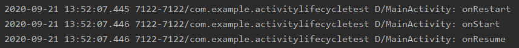

点击第二个按钮，启动DialogActivity

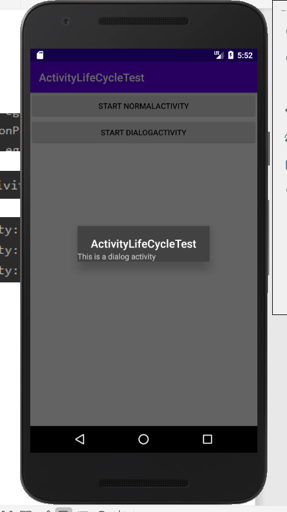

只有onPause()方法执行了，onStop()方法并没有执行，因为DialogActivity没有完全遮挡住MainActivity，MainActivity只是进入了暂停状态，按下Back键返回MainActivity也只有onResume()方法执行了。

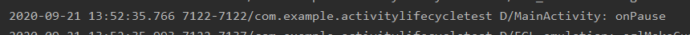

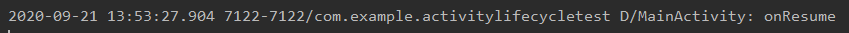

最后在MainActivity按下Back键退出程序，会依次执行onPause()、onStop()和onDestroy()方法。

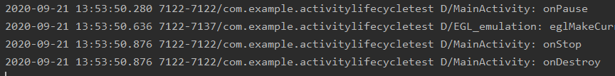